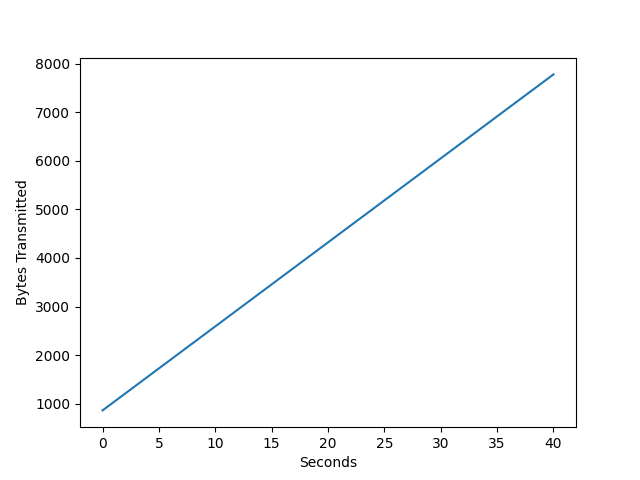
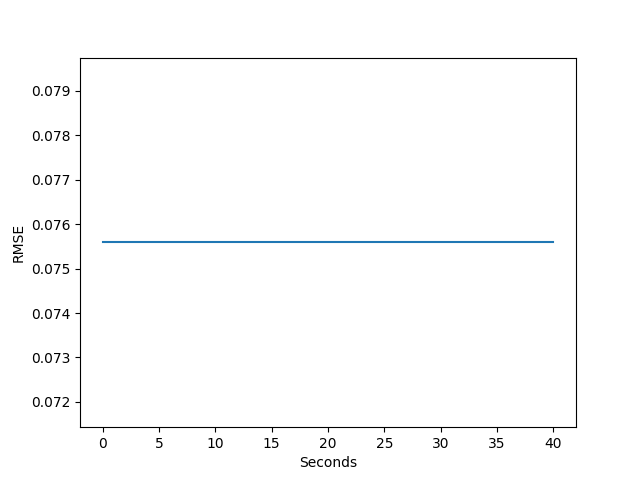

# LSP2P

First install python and pip package and download the dependencies
   
   ```shell
   pip install -r requirements.txt
   ``` 
## Train Gossip Learning 

1. Start training
   
   ```shell
   python train_gossip_pmf.py
   ```

2. If you don't know what args to give, type
   
   ```shell
   python train_gossip_pmf.py --help
   ```
    ### Traing Results
    Node number : 10 
    
    Epoch : 1000

    

    

## Train LSP2P

1. Start training
   
   ```shell
   python train_gossip_pmf.py
   ```

2. If you don't know what args to give, type
   
   ```shell
   python train_lsp2p_pmf.py --help
   ```
    ### Traing Results
    Node number : 10

    Epoch : 100
    
    

    
